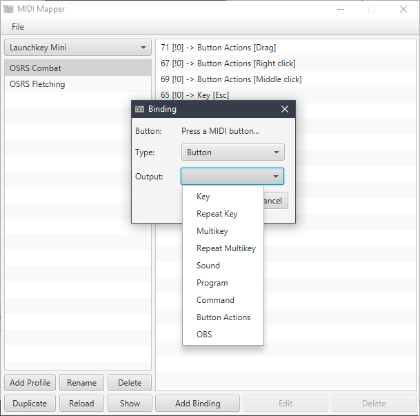
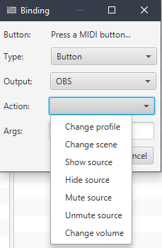
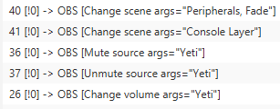
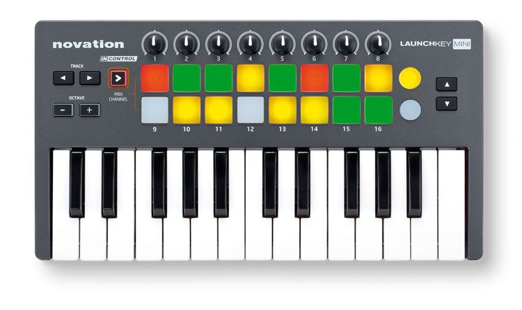

# MIDI-Mapper

### A program used to map MIDI buttons to computer actions

## Requirements
- Java 8

## Installing
The latest jar can be downloaded [here](https://github.com/TSedlar/MIDI-Mapper/releases)

## Screenshots

## OBS

This can be used with OBS as an alternative to a Stream Deck.

It requires [obs-websocket](https://github.com/Palakis/obs-websocket) to be installed.

### Supported Operations

### Example Integrations

Arguments should be separated with a comma.

As can be seen in the scene changes, if a transition is wanted, the name of the transition should be included after the name of the scene.

If using a knob to change volume of a source, no argument is needed.

If using a button to change volume, one needs to include it after the source name: `Yeti, 0.5` (change yeti to 50% volume)

### Example devices

